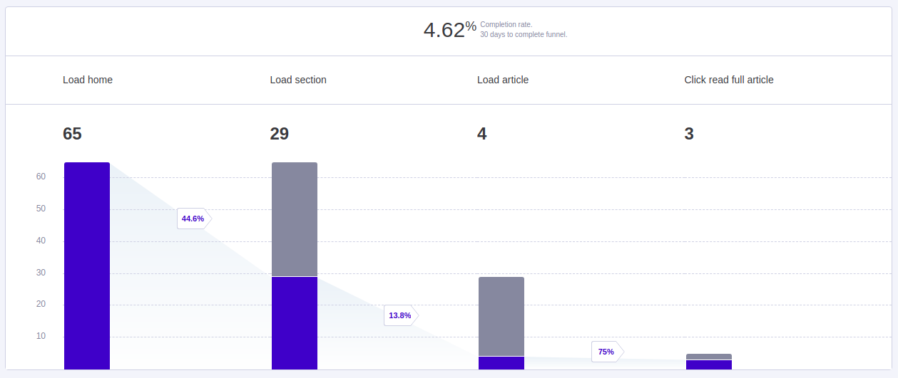
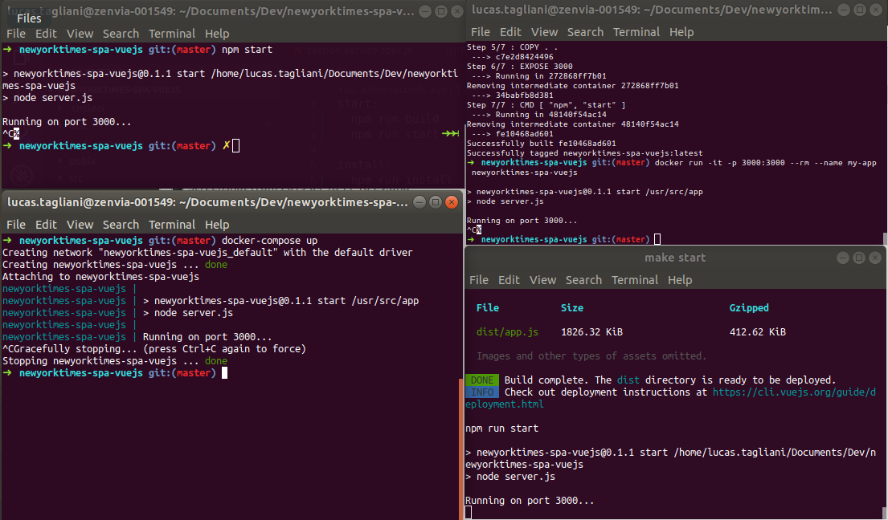

# newyorktimes-spa-vuejs

* Este arquivo foi escrito em português e evita estrangeirismos para que não limite o seu compreendimento à  pessoas que possuem conhecimento no idioma inglês.

## Esta é a solução certa?

Se este fosse um problema real, antes de começar qualquer desenvolvimento, eu teria feito as seguintes perguntas para pessoa que fosse dona do produto:

1. Este sistema é a melhor maneira de manter a equipe da _Thoughtworks_ atualizada? Que outras maneiras seriam possíveis?
2. Se sim, como será a divulgação deste sistema para as pessoas da equipe?
3. Existe algum dia do mês, da semana ou horário do dia que o sistema será acessado com mais frequência? Quão frequente você imagina que seja?
4. Será mais acessado pelo celular ou pelo computador? E por tables? Televisões? Algum outro dispositivo? Quais navegadores serão utilizados?
5. O que faria as pessoas acessarem este sistema ao invés de acessar diretamente o site do _The New York Times_? Qual o diferencial?

## Regras de negócio / Suposições

* Uma das seções do site (_Science & Tech_) soma os artigos das seções "science" e "technology" da API do NYTimes;
* São exibidos no máximo 12 artigos por seção;
* Entre performance e a possibilidade de compartilhar a URL de artigos com outras pessoas, a segunda foi priorizada;
* Caminhos de URL inválidos são automaticamente redirecionados para caminhos válidos;

## Resumo do que você vai encontrar aqui (tecnicamente):

* Estrutura do código com [Vue.js](https://vuejs.org/);
* Versionamento de código com [Git](https://git-scm.com/);
* Repositório de código no [GitHub](https://github.com/lucastagliani/notes-webapi-nodejs), mas de forma particular, respeitando o critério de não compartilhar esta solução;
* Gerenciamento de pacotes com [NPM](https://www.npmjs.com/);
* Padronização de código com [ESLint](https://eslint.org/) e [EditorConfig](https://editorconfig.org/);
* Containerização com [Docker](https://www.docker.com/);
* Integração contínua com [CircleCI](https://circleci.com/);
* Versão publicada em [Heroku](https://www.heroku.com/), mas sem compartilhar com ninguém o endereço;
* Testes unitários com [Chai](https://www.chaijs.com/);
* Testes funcionais com [Cypress](https://www.cypress.io/);
* Eventos analíticos com [Mixpanel](https://mixpanel.com/);

## Das bibliotecas e ferramentas utilizadas:

* Apesar de Angular 2+ com _typescript_ ser a estrutura de _front-end_ que tenho mais conhecimento, escolhi Vue.js com o objetivo de aproveitar este projeto para aprofundar meus conhecimentos nesta biblioteca que uso profissionalmente há 5 meses.
* Bulma.io por ser uma biblioteca simples de CSS e ajudar na construção da interface;
* axios para fazer as requisições HTTP na [API do "nytimes"](https://developer.nytimes.com/);
* Mixpanel para monitorar o uso do sistema (quantos usuários estão visitando cada página, quais seções, etc), aprendendo com os dados gerados e habilitando a tomada de decisões a partir deles;

## O que foi feito:

* O _desgin_ do sistema traz lembranças do _New York Times_, utilizando o mesmo _favicon_, título, logotipo, uma fonte similar e cores apenas com tons de preto para manter a essência, mas com uma interface mais limpa e moderna exibindo menos seções e artigos. A página inicial, ao invés de trazer notícias de várias seções diferentes, traz apenas a escolha de seções pré-definidas com um linguajar um pouco mais coloquial. O idioma no site é em inglês para que seja coerente com o conteúdo dos artigos retornados da _[API](http://developer.nytimes.com/)_.

* Qualquer requisição feita num endereço inexistente redireciona o usuário para a página inicial `"/nyttop"`.

* A arquitetura da aplicação foi baseada na componetização de pequenos pedaços do portal de notícias, para que não tenhamos nenhum arquivo com complexidade muito alta. Estes componentes foram utilizados em três páginas principais: Página inicial, detalhe de seção e detalhe de artigo.

* Os arquivos foram separados conforme seus contextos, por exemplo o arquivo `src/http/nytimes.js` é responsável apenas por fazer as requisições HTTP para API (infraestrutura), enquanto o arquivo `src/services/articlesService.js` consulta estes dados e aplica as devidas regras de negócio.

* O plugin [CodeMetrics](https://marketplace.visualstudio.com/items?itemName=kisstkondoros.vscode-codemetrics) da _IDE_ [VS Code](https://code.visualstudio.com/) estava instalado durante o desenvolvimento para evitar que qualquer método do código ficasse com uma complexidade ciclomática acima de 6.

* Este código é escrito mais para humanos do que para máquinas, então as variáveis, propriedades e métodos tem nomenclaturas significativas, evitando abreviações. Na mesma linha de raciocínio, alguns métodos tem apenas uma linha de código, mas por terem um nome significativo, deixam a leitura do código clara.

* Cada `push` feito na _branch_ `master` vai disparar uma tarefa na [ferramenta de integração contínua](https://circleci.com/gh/lucastagliani/newyorktimes-spa-vuejs) que vai compilar o código fonte, executar os testes unitários e funcionais e, se tudo der certo, publicá-lo em [Heroku](https://newyorktimes-spa-vuejs.herokuapp.com/).

* Cada `commit` feito no código fonte, dispara uma tarefa do _lint_ para manter a padronização de código num certo nível.

* Os _commits_ foram feitos em inglês e padronizados [nesta convenção](https://gist.github.com/joshbuchea/6f47e86d2510bce28f8e7f42ae84c716).

## O que pode ser melhorado:

* Melhorar gerenciamento de dados com [Vuex](https://vuex.vuejs.org/ptbr/guide/state.html): é uma das possíveis formas de evitar uma requisição a API a cada artigo carregado. Aliás, esta escolha foi tomada para priorizar a possibilidade de compartilhar um artigo diretamente pela URL;
* Adicionar imagens nos cartões dos artigos pra chamar mais atenção das pessoas usuárias na página detalhes da seção;
* Criar caminho de navegação (_breadcrumb_) entre as páginas;
* Carregamento ocioso nos artigos de cada seção conforme o usuário fosse rolando a tela para baixo;
* Melhorar tratamento de erros de API externa;
* Uso de variáveis no CSS;
* Testes funcionais e2e deveriam usar CYPRESS COMMANDS para requisitar seções ou artigos (mas para isto, deveríamos ter um maior controle da API, utilizando POSTs ou podendo fazer GET em artigos mais antigos) ao invés de fazer isto navegando pela página quando não fosse o principal a ser testado, também evitaria seletores duplicados entre os arquivos de testes de detalhe de seção e de artigo;
* Testar views também de forma unitária, criando mocks para as camadas de serviço através das `props` dos componentes Vue;
* Diversos TODOs no código;

## Pré-requisitos para rodar a aplicação

* No mínimo, você vai precisar ter o [NPM](https://www.npmjs.com/) instalado na sua máquina.

_É possível verificar se você já possui o NPM executando o comando `npm --version` no seu terminal._

## Como rodar?

_Se você já sabe como funciona um [Makefile](Makefile), pode dar uma olhada nele!_

1. Após fazer o `git clone` ou descompactar o projeto, certifique-se que você está na raiz do mesmo, enxergando pastas como `public`, `src` e `tests`;

2. Você precisa instalar as dependências, então  execute `npm install` na linha de comando e aguarde o término de sua execução.

3. Agora vamos lá, existem três formas de iniciar a aplicação:

  Na mais tradicional, execute `npm start` no seu terminal.

  OU

  Para compilar o container da aplicação, execute: `docker build -t newyorktimes-spa-vuejs .`

  E, para executá-lo, execute: `docker run -it -p 3000:3000 --rm --name my-app newyorktimes-spa-vuejs`

  OU

  Se você tiver o [Docker Compose](https://docs.docker.com/compose/) instalado na sua máquina, pode executar `docker-compose up` no seu terminal.

Em ambos casos, você poderá acessar o sistema em `http://localhost:3000` - A menos que a variável de ambiente `PORT` tenha algum valor customizado no seu computador.

Para parar a execução do sistema, um CTRL + C no terminal deve bastar.

Após isto, se você quiser parar o container da segunda opção, precisará do comando `docker stop`. Pode ver a [documentação aqui](https://docs.docker.com/engine/reference/commandline/stop/).

Ou se você quiserar parar corretamente o que foi executado na terceira opção, precisará do comando `docker-compose down`. Veja mais [aqui](https://docs.docker.com/compose/reference/down/).

## Outros comandos úteis:

* Executar testes unitários: `npm run test:unit`
* Abrir testes funcionais: `npm run test:e2e` (necessário que a aplicação esteja rodando)
* Executar lint e corrigir arquivos: `npm run lint`
* Executar em modo de desenvolvimento: `npm run serve`
* Gerar código compilado para publicação no diretório /dist: `npm run build`
